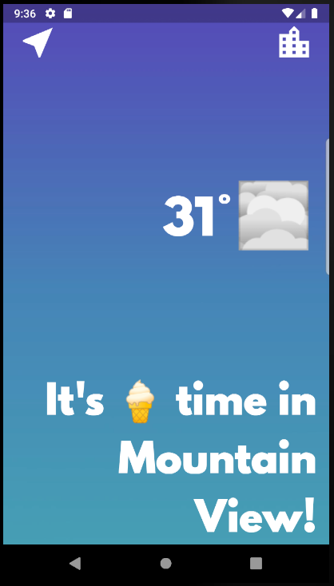
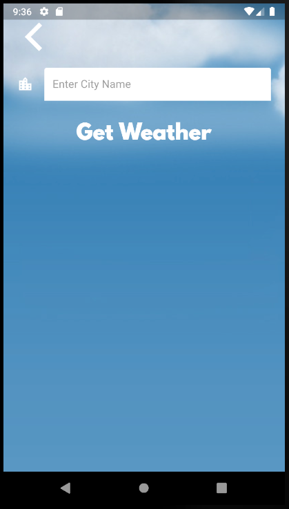

# Weather-Today ☁
Provides you with the current weather information - for your current location as well as valid searched location

 

**Note:** Create an account on https://openweathermap.org/ and a new dart file named keys in the lib/utilites folder and store your key in apiKey after cloning the project for using this project. 

